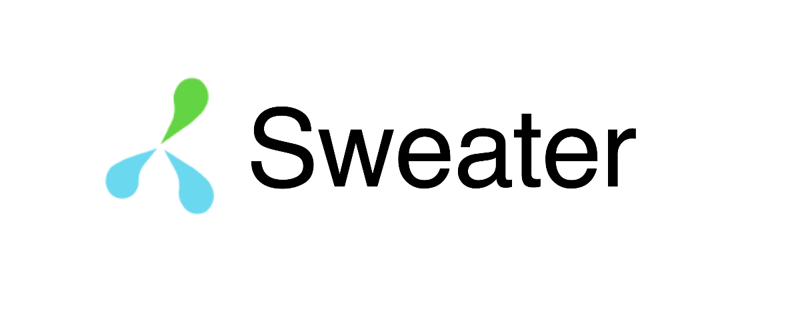

# 등산 커뮤니티 Sweater

## 프로젝트 소개
* **Sweater**는 등산을 좋아하는 사람들이 자신의 등산 경로를 공유하고, 다른 사람과 함께 등산할 수 있는 소셜 커뮤니티입니다.
* **Video 페이지**의 AI 챗봇을 활용하여, 다양한 등산 정보를 얻거나 관련 동영상을 시청할 수 있습니다.
* **Board와 Thunder 페이지**의 지역 및 태그 선택을 통해, 사용자는 원하는 정보를 필터링 할 수 있습니다.
* **Board와 Thunder 게시글 생성 시**, 사용자는 지도에서 등산로를 지정하여 나만의 등산로를 만들 수 있습니다.
* **Board와 Thunder 상세 게시글에서**, 댓글로 소통할 수 있으며 Thunder에서는 Invite로 유저끼리 소통할 수 있습니다.
* **My Page**에서 프로필 사진과 소개를 설정하고, 나의 게시글과 댓글 그리고 나에게 온 메시지 목록을 확인할 수 있습니다.
* **카카오 소셜 로그인**을 통해서 회원가입 및 로그인을 할 수 있습니다.

## 팀원 구성
* **최다환**
  - 메인: 백엔드 (프론트엔드 서브)
  - 기능: AI 챗봇, 소셜 로그인 (이 외 공동 구현)
* **정상영**
  - 메인: 프론트엔드 (백엔드 서브)
  - 기능: 나의 등산로, 동영상 검색 (이 외 공동 구현)

## 개발 환경
* **Front**: HTML, CSS, JavaScript, Vue.js
* **Back**: Java, SpringBoot
* **버전 관리**: Gitlab
* **협업 툴**: Notion, Mattermost
* **디자인**: Figma
* **코드 컨벤션**: Prettier

## 개발 기간 및 작업 관리
* **전체 개발 기간**: 2024-05-16 ~ 2024-05-23
* **기획 및 목업 제작**: 2024-05-16 ~ 2024-05-17
* **기능 구현**: 2024-05-18 ~ 2024-05-23

## 페이지 별 기능
1. **Main**
   - 추천 컨텐츠 및 신규 게시글을 볼 수 있는 섹션이 있습니다.
   - Nav의 심볼을 누르면 애니메이션과 함께 Main 페이지로 이동합니다.
   
2. **Sign up**
   - ID, 패스워드, 닉네임을 DB와 비교하여 유효성 검사를 진행하며, 통과하지 못한 경우 경고 문구가 표시됩니다.
   - 이메일 인증으로 인증번호를 받아 인증 후 가입 가능하도록 구현했습니다.
   
3. **Log In**
   - DB에서 회원 정보를 찾아, 로그인 할 수 있습니다.
   - 카카오 소셜 로그인을 구현했습니다.
   
4. **My Page**
   - 사진을 클릭하면 프로필 이미지를 변경할 수 있습니다.
   - 자기소개글을 등록 및 수정할 수 있습니다.
   - 나의 게시글과 댓글 목록, 좋아요한 게시글, 댓글 목록, 메시지를 확인할 수 있습니다.
   
5. **Video**
   - AI 챗봇과 대화할 수 있습니다.
   - 동영상을 검색할 수 있습니다.
   
6. **Board**
   - 지역과 산으로 게시글을 필터링 할 수 있습니다.
   
   - 로그인 한 상태에서 내가 작성하지 않은 글이라면, 좋아요를 누를 수 있습니다.
   - 댓글을 작성할 수 있습니다.
   
   - 작성 시 지도를 커스터마이징해서 나만의 등산로를 생성할 수 있습니다. 나만의 등산로는 DB에 게시글과 연동되어 저장됩니다.
   
7. **Thunder**
   - 지역과 산으로 게시글을 필터링 할 수 있습니다.
   - 로그인 한 상태에서 내가 작성하지 않은 글이라면, 좋아요를 누를 수 있습니다.
   - 댓글을 작성할 수 있습니다.
   - 작성 시 지도를 커스터마이징해서 나만의 등산로를 생성할 수 있습니다. 나만의 등산로는 DB에 게시글과 연동되어 저장됩니다.
   
   - 댓글을 통해 유저와 소통할 수 있으며, Invite를 통해 생성한 메시지는 My Page에서 확인할 수 있습니다.
   

## 후기

### 정상영
싸피에서 약 5개월의 교육 기간을 마친 후 처음으로 진행한 프로젝트였습니다. 그간 실무 혹은 기획자로서의 프로젝트 경험은 있었지만, 개발자의 입장에서 제품을 만드는 경험은 전혀 달랐습니다.

첫 번째로, 협업의 중요성을 절실히 느꼈습니다. 제가 협업 능력이 부족하다고 생각한 적은 없었는데, 이번 프로젝트 동안 일정 관리, 목표 관리 등 여러 협업 과정에서 제가 페어를 괴롭히거나 프로젝트 진행을 더디게 하는 원인이 되었다는 것을 깨달았습니다. 2학기 동안 3번의 프로젝트를 통해 협업 능력을 키워 잘 협업하는 개발자가 되고 싶습니다.

두 번째로, 배울 것이 아직 많다는 것을 몸소 느꼈습니다. Vue3 공식 문서를 많이 읽었다고 생각했지만, 프로젝트에서 사용하기 위해 검색했던 다양한 오픈 소스 라이브러리와 더 나은 기술들을 보며 공부하고 싶은 열망과 겸손함을 갖게 되었습니다. 프로젝트가 끝나고 잡페어 기간 동안 웹사이트를 만들어 공부한 것을 직접 기록하겠다는 목표가 생겼습니다.

마지막으로 1학기를 마치며, 처음 입교했던 자신이 생각났습니다. 수학과 거리를 두고 살았기에 알고리즘을 처음 배울 때 개발자의 길을 포기하고 싶었습니다. 솔직히 포기했었습니다. 그러나 Spring을 거쳐 프론트엔드를 배우며 프로그래밍의 재미를 알게 되었고, 최근에는 알고리즘 역량 테스트에서도 목표 이상의 성적을 받아 유의미한 한 학기를 보냈다고 생각합니다. 마지막 프로젝트를 함께 해준 페어와 한 학기를 같이 보낸 반 친구들에게 모두 고맙습니다.

### 최다환
개발 노베이스임을 걱정하며 입과한 지 5개월이 지나고, 최종 프로젝트를 하게 됐을 때 처음엔 걱정이 앞섰습니다. 배운 것 만으로 하고자 하는 것들을 구현할 수 있을지 혹은 나의 부족함으로 인해 나의 페어에게 피해를 주지 않을지에 대한 걱정이었습니다. 하지만, 프로젝트를 진행하는 것이 힘들지라도 개발은 재밌다는 것을 깨달았던 첫 프로젝트였습니다.

프로젝트를 진행하며 개발은 끊임없이 소통하고, 협업하는 것이 중요하다는 것을 느꼈습니다. 기획 단계에서 API 명세를 작성하고, 하고자 하는 기능, 목표, 일정 등을 미리 정하고 개발을 시작했음에도 변수 이름, 구조, 데이터베이스 수정 등 팀원과 논의하여 결정해야 하는 일이 많았습니다. 이번 기회를 통해 의사소통 능력을 기르고 Git 시스템에 대해 배울 수 있었습니다.

또한, 개발의 길은 무수히 많고, 아직 더 배워야 함을 느꼈습니다. 같은 기능을 개발하더라도 더 쉬운 방법이 있다는 것을 이번 프로젝트를 진행하며 느꼈고, 그 방법들을 이해하기 위해서는 자바라는 언어부터 다른 라이브러리까지 알고 있어야 한다는 것을 알게 되었습니다. 또한, 이번 프로젝트에 사용하지 못했지만, filter, security, stream, lombok, jpa, validation 등 어떤 것을 먼저 공부할 지에 대해 정할 수 있는 기회가 되었습니다.

개발의 길에 너무 늦게 들어온 것 같다는 걱정을 많이 했었는데 이번 프로젝트를 통해 그럼에도 개발이 재밌다는 것을 다시 한 번 깨달았습니다. 포기하고 싶고, 도망치고 싶더라도 첫 프로젝트를 마치고 느꼈던 뿌듯함과 구현한 기능이 작동하는 설렘을 상기하며 버틸 수 있을 것 같습니다. 소중한 첫 번째 프로젝트를 함께 달려준 페어와 알고 있는 것들을 흔쾌히 나눠주는 5반 친구들에게 감사를 전합니다.
